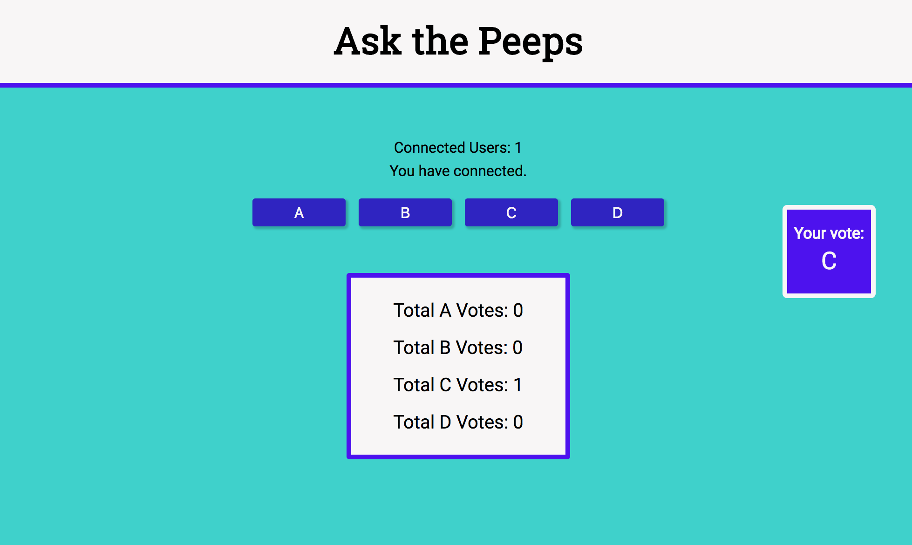

# Ask the Audience

[Voting Application](https://ask-the-peeps.herokuapp.com/)

This WebSockets Application allows users to vote in an interactive communication session between the user's browser and a server. The user is only allotted one vote. However, there can be many users at one time who can cast a vote.
